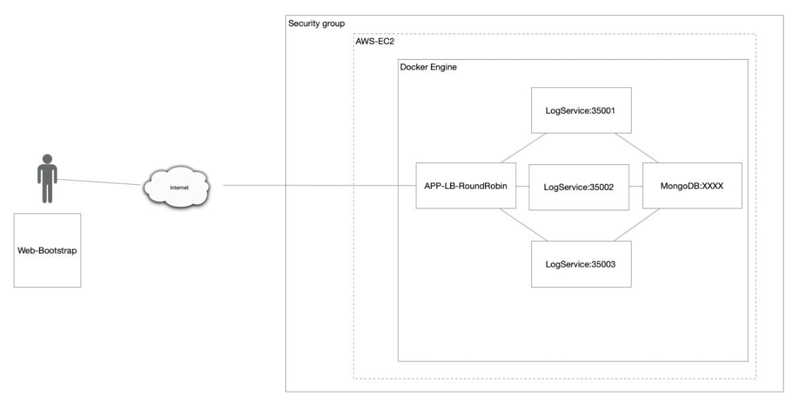

# Taller de Modularizacion con Virtualización e Introducción a Docker y a AWS

Este taller consiste en la creacionb de una aplicacion web pequeña utilizando el framework de Spark. Una vez se tenga dicha aplicacion se procede a construir un contanier de docker para la aplicacion el cual será desplegado y configurado en la maquina local. Luego, se crea un repositorio enDockerHub para subir la imagen al repositorio. Finalmente, se crea una maquina virtual en AWS en la cual va a estar instalado Docker y se desplegará el contenedor creado.

## Comenzando 🚀

Se presentaran un conjunto de instrucciones para que este pueda tener un funcionamiento correcto en maquina local.

Mira **Deployment** para conocer como desplegar el proyecto.


### Pre-requisitos 📋

Para un optimo funcionamiento del proyecto en un ambiente de desarrollo se debe contar con los siguientes Apps instaladas y configuradas (en el caso de Java y Maven):

- [Java](https://www.java.com/es/download/ie_manual.jsp) : Lenguaje y entorno de desarrollo.
- [Maven](https://maven.apache.org/) : Gestor de dependencias.
- [Spark](https://sparkjava.com/download) : Micro-framework para desarrollo web.
- [Git](https://git-scm.com/) : Software para control de versiones.
- [Docker](https://www.docker.com) : Contanier Manager.
- [AWS](https://aws.amazon.com) : Servicio de despliegue.
### Instalación 🔧

Para esto se puede utilizar cualquier shell que prefiera.

1. ***Clonar el proyecto***
    ```
    git clone https://github.com/luis-amaya/TallerModularizacion.git
    ```

2. ***Compilar el proyecto***
   ````
   mvn clean install
   ````
3. ***Ejecutar docker compose***
   ````
   docker-compose up -d
   ````
4 ***Ahora ejecute la aplicacion***
    ````
    java -cp "target/classes:target/dependency/*" co.edu.escuelaing.virtualization.dockerdemo.SparkWebServer
    ````

## Arquitectura 🚧

1. El servicio MongoDB es una instancia de Mongo corriendo en un container de docher en una maquina virtual de EC2 en AWS.
2. LogService es un servicio REST el cual recibe una cadena, la almacena en la base de datos MongoDB y responde en un objeto JSON con las ultimas 10 cadenas almacenadas en la base de datos y en que fecha fueron creadas. Para esta arquitectura en especifico se utilizaran 3 instancias.
3. App-Lb-RoundRobin está compuesta por un cliente web y un servicio REST. El cliente tiene un campo y un botón. Cada vez que el usuario envía un mensaje, este lo envía al servicio REST y actualiza la pantalla con la informacion que recibe de parte del servicio el cual está en formato JSON. El servicio implementa un algoritmo de balanceo de cargas de Round Robin, delegando el procesamiento del mensaje y el retorno de la respuesta a cada una de las tres instancias del servicio LogService.
## Despliegue 📦

El despliegue se puede encontrar en [Heroku](https://look-stock.herokuapp.com/html/aplication.html)

## Construido con 🛠️
Proyecto construido con:

* [Spark](https://sparkjava.com/download) - El framework web usado
* [Maven](https://maven.apache.org/) - Manejador de dependencias


## Autores ✒️

***Luis Gerardo Amaya Ortiz***

## Licencia 📄

Este proyecto está bajo la Licencia (Tu Licencia) - mira el archivo [LICENSE.md](LICENSE.md) para detalles


Plantilla de README por: [Villanuevand](https://github.com/Villanuevand) 